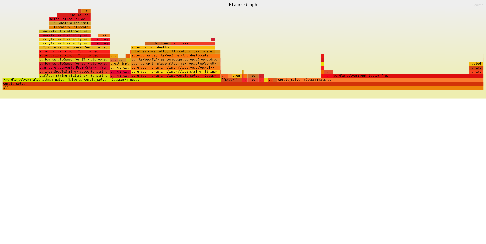

# Profiling

https://github.com/jonhoo/inferno

## Naive

# Reference

- [Implementing and Optimizing a Wordle Solver in Rust](https://youtu.be/doFowk4xj7Q)
- [jonhoo/roget](https://github.com/jonhoo/roget)
